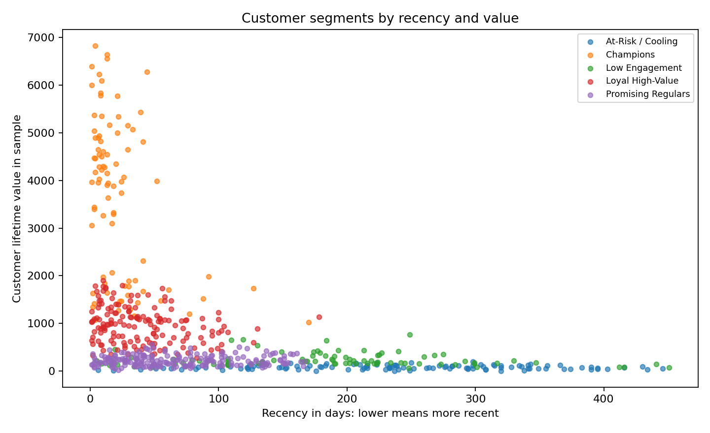
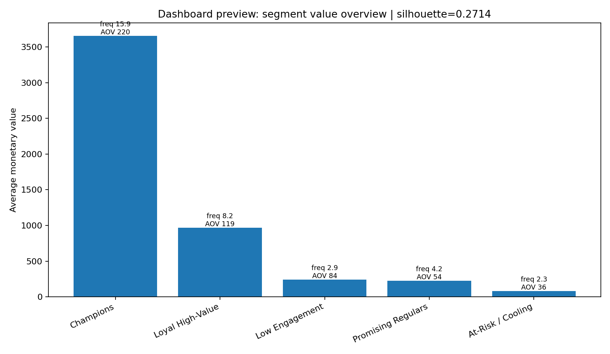

# Customer Segmentation with RFM and K-Means

This project turns transaction-level retail data into customer segments a CRM or marketing team could actually use. The goal is not to chase a perfect clustering score; it is to create a transparent workflow that cleans messy order data, builds customer-level features, and translates clusters into business actions.

## Why I built this

Many beginner portfolio projects stop at `model.fit()`. I wanted this one to look closer to a small workplace analysis: raw records, cleaning choices, SQL checks, repeatable scripts, model artifacts, and a dashboard preview.

## Data

The repository includes a **synthetic retail sample** in `data/raw/online_retail_sample.csv`.

It was generated to mimic common e-commerce fields: invoice number, stock code, quantity, invoice date, unit price, customer ID, and country. A few dirty rows are intentionally included, for example negative quantities, so the cleaning step has something real to do.

I used synthetic data because it keeps the repo reproducible and avoids shipping private customer data. The limitation is that the final segments should be read as a workflow demonstration, not as claims about a real company.

## Business questions

- Which customers are recent, frequent, and high-value?
- Which groups look loyal, promising, occasional, or at risk?
- How can a marketing team prioritize retention and reactivation campaigns?
- What customer-level tables would analysts need downstream?

## Workflow

```text
raw transactions -> cleaning -> customer feature table -> K-Means -> segment labels -> reports / app / API
```

## Repository structure

```text
customer-segmentation-kmeans/
├── app/                  # Streamlit dashboard
├── api/                  # FastAPI scoring endpoint
├── data/
│   ├── raw/              # Synthetic input sample
│   └── processed/        # Generated tables
├── models/               # Trained scaler, model, metadata
├── reports/              # Notes and screenshots
│   └── figures/
├── sql/                  # Analyst-facing SQL checks
├── src/                  # Reusable pipeline code
└── tests/                # Basic unit tests
```

## How to run

From this folder:

```bash
python -m src.features
python -m src.train
python -m src.make_figures
pytest -q
```

Optional app/API:

```bash
streamlit run app/streamlit_app.py
uvicorn api.main:app --reload
```

## Outputs from the latest run

- `data/processed/customer_features.csv`
- `data/processed/customer_segments.csv`
- `data/processed/cluster_summary.csv`
- `models/kmeans.joblib`
- `models/scaler.joblib`
- `models/metadata.json`
- `reports/figures/segment_value_recency.png`
- `reports/figures/dashboard_preview.png`


## Screenshots

### Segment value vs recency



### Dashboard preview



## What I would improve next

- Replace the sample with a real permitted dataset or internal CRM export.
- Add cohort analysis and retention curves.
- Test stability of clusters across several random seeds and time windows.
- Add campaign outcome data to validate whether the segment labels are useful.
